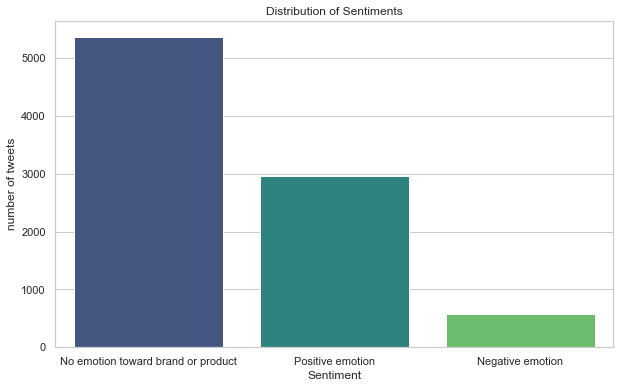

#### TWITTER SENTIMENT ANALYSIS CLASSIFIER FOR APPLE AND GOOGLE PRODUCTS

## Project Overview
This project will build a Natural Language Processing (NPL) model that classifies twitter sentiments that are related to Google and Apple products. The aim of the sentiment analysis is to comprehend the public opinion and emotions towards the particular brands to enable companies to monitor brand perception, customer satisfaction and identify potential issues. The project will build a proof-of-concept model that starts with a simple binary classification (Positive & Negative) and extent to a more realistic multiclass setting.  

### Problem Statement
Thousands of consumers give their opinions on Apple and Google products through social media platforms such as Twitter. Many companies monitor these opinions to understand on their brand perception in the market for better decision-making and improvements. Manual monitoring of online consumer opinions is difficult hence; most firms have established automated methods for identifying customer sentiments towards a brand. Natural Language Processing (NPL) is one of the solutions that automatically classify tweets related to Apple and Google products based on sentiments.

### Stakeholders & Business Questions
## The main stakeholders include:
Marketing Team – Identifying the public opinion towards the product for better formulation of market campaigns.
Customer Excellence Team- Essential in identify customer complaints and recommending strategies for improvement.
Product and brand managers- Identifying the strengths and wekness of the brand and reputation.
Company Executives- Vital in supporting strategic decision-making.
## Business Questions:
Can tweets about Apple and Google products be automatically classified as positive, negative or neutral for better understanding of customer sentiment?
What is the overall sentiment toward Apple and Google products?
Which products generate the most positive and negative reactions?
What words are commonly associated with positive and negative sentiment?
How accurately can machine learning predict tweet sentiment?

### Data Understanding
The data was sourced from CrowdFlower via data.world. The dataset contains text data which are tweets about Apple and Google products and labels which are sentiments (positives, negatives and neutral).
## Key Variables
The dataset has 3 columns with three variables namely;
Tweet_text- describes the original tweet content
Sentiment – provides the sentiment label (positive, negative, neutral)
Product - Products mentioned are Apple or Google
## Target Variable
The target variable is sentiment. It will help in identifying the distribution of sentiment classes and potential imbalance between target classes.
•	Distribution of sentiment classes 
•	Examples of tweets in each category 
•	Potential imbalance between classes 
This step is important because imbalanced data can bias a model toward predicting the majority class

## Data Preparation and Cleaning
The dataset will then be cleaned by removing missing values to enhance reliability, elimination of stop words, removal of tweets labelled *“I can’t tell”* and simplifying the **target_brand** field into two main groups(Apple and Google).
## Text Preprocessing
In this stage, we transform the tweet dataset into a suitable format for machine learning through a structured preprocessing workflow. The text preprocessing workflow include:

- Convestion of text to lowercase.

- Removal of URLs

- Removal of twitter handles

- Removal of punctuation and special characters

- Removal of stopwords 

- Lemmatization 
These steps are vital in reducing irrelevant information, standardizing the text, and improving the effectiveness of the sentiment classification model.
The complete preprocessed tweet is converted into a clean and standardized text for vectorization using TF-IDF thus enhancing computational efficienct and performance of the sentiment model.

## EXPLORATORY DATA ANALYSIS (EDA)
Several visualizations were created to help understand the feature components of the data before modelling.

## Target variable distribution 
