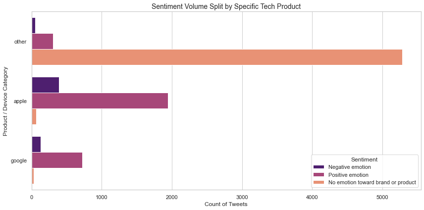
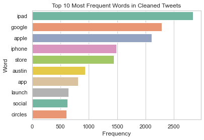
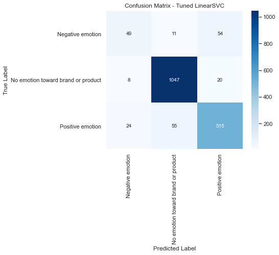
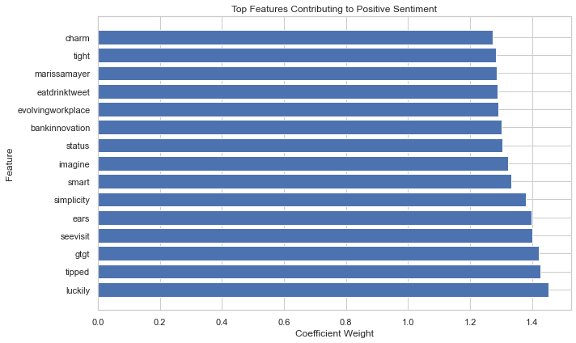

#### TWITTER SENTIMENT ANALYSIS CLASSIFIER FOR APPLE AND GOOGLE PRODUCTS

## Project Overview
This project will build a Natural Language Processing (NPL) model that classifies twitter sentiments that are related to Google and Apple products. The aim of the sentiment analysis is to comprehend the public opinion and emotions towards the particular brands to enable companies to monitor brand perception, customer satisfaction and identify potential issues. The project will build a proof-of-concept model that starts with a simple binary classification (Positive & Negative) and extent to a more realistic multiclass setting.  

### Problem Statement
Thousands of consumers give their opinions on Apple and Google products through social media platforms such as Twitter. Many companies monitor these opinions to understand on their brand perception in the market for better decision-making and improvements. Manual monitoring of online consumer opinions is difficult hence; most firms have established automated methods for identifying customer sentiments towards a brand. Natural Language Processing (NPL) is one of the solutions that automatically classify tweets related to Apple and Google products based on sentiments.

### Stakeholders & Business Questions
## The main stakeholders include:
Marketing Team – Identifying the public opinion towards the product for better formulation of market campaigns.
Customer Excellence Team- Essential in identify customer complaints and recommending strategies for improvement.
Product and brand managers- Identifying the strengths and wekness of the brand and reputation.
Company Executives- Vital in supporting strategic decision-making.
## Business Questions:
Can tweets about Apple and Google products be automatically classified as positive, negative or neutral for better understanding of customer sentiment?
What is the overall sentiment toward Apple and Google products?
Which products generate the most positive and negative reactions?
What words are commonly associated with positive and negative sentiment?
How accurately can machine learning predict tweet sentiment?

### Data Understanding
The data was sourced from CrowdFlower via data.world. The dataset contains text data which are tweets about Apple and Google products and labels which are sentiments (positives, negatives and neutral).
## Key Variables
The dataset has 3 columns with three variables namely;
Tweet_text- describes the original tweet content
Sentiment – provides the sentiment label (positive, negative, neutral)
Product - Products mentioned are Apple or Google
## Target Variable
The target variable is sentiment. It will help in identifying the distribution of sentiment classes and potential imbalance between target classes.
•	Distribution of sentiment classes 
•	Examples of tweets in each category 
•	Potential imbalance between classes 
This step is important because imbalanced data can bias a model toward predicting the majority class

## Data Preparation and Cleaning
The dataset will then be cleaned by removing missing values to enhance reliability, elimination of stop words, removal of tweets labelled *“I can’t tell”* and simplifying the **target_brand** field into two main groups(Apple and Google).
## Text Preprocessing
In this stage, we transform the tweet dataset into a suitable format for machine learning through a structured preprocessing workflow. The text preprocessing workflow include:

- Convestion of text to lowercase.

- Removal of URLs

- Removal of twitter handles

- Removal of punctuation and special characters

- Removal of stopwords 

- Lemmatization 
These steps are vital in reducing irrelevant information, standardizing the text, and improving the effectiveness of the sentiment classification model.
The complete preprocessed tweet is converted into a clean and standardized text for vectorization using TF-IDF thus enhancing computational efficienct and performance of the sentiment model.

## EXPLORATORY DATA ANALYSIS (EDA)
Several visualizations were created to help understand the feature components of the data before modelling.

## Target variable distribution 

# Key insights
The distribution of sentiments show that most tweet sentiments were neutral while a medium number of tweets were of positive emotion sentiments.

## Brand sentiment Analysis
Sentiments were analyzed across the target brands and visualized as below.

The graph  above shows class imbalance across the different brands as more 50% of the sentiments are neutral (No emotion toward brand or product). This imbalance results to misleading model performance metrices such as accurecy hence making it unreliable in business decisions.

## Frequency of words in the tweets
The most frequent words highlight the main themes in the cleaned tweets, showing the key topics users are talking about. This helps in understanding common discussion patterns and overall sentiment context in the dataset.

### Feature Engineering
In this project, two types of features were created namely;
## Text Features
TF-IDF Vectorization
Parameter tuning to maximize features, n-gram range and minimum document frequency.
## Brand Features
One-Hot Encoding which was applied to brand variable and ColumnTransformer pipeline.

### Machine Learning Models
The models used in this project include;

## Logistic Regression 
The baseline model was used due to its good perfomance on high-dimensional sparse text data and interpretable outputs.
The model was tested using binary classification then improved with multiclass classification.
Further, the logistic model on the multiclass was applied to class weighting to address the issue of class imbalance.

## Multinomial Naive Bayes
This model is widely used in task classification tasks due to its simplicity, speed to train, and works well with word-frequency based features.

## Tuned LinearSVC
Hyperparameter optimization in conjunction with GridSearchCV were used this model to improve its classication performance. 

Cross-validation assisted in model regularization and the use of macro F1-score helps ensure that all the sentiment classes, both majority and minority are taken into consideration during model selection.

## Best Model
The tuned LinearSVC achieved the strongest balance between overall accuracy and minority-class performance.

### Model Classification Report
The main evaluation matrix used in determining the model performance include; 
- Accuracy
- Precision
- Recall
- F1-score

Macro F1-score
The tuned LinearSVC achieved approximately:

Accuracy: 90.3%
Macro F1-Score: 0.76
## Model Summary

| Metric | Value |
|---|---|
| Final Model | LinearSVC (Optimized, RandomizedSearchCV) |
| Test Macro F1 | ~0.78 |
| Negative emotion Recall | ~0.43 (minority class) |
| No emotion toward brand or product Recall | ~0.97 |
| Positive emotion Recall | ~0.87  |
| Validation Strategy | Stratified 80/20 split + 5-fold CV inside RandomizedSearchCV |

## Confusion Matrix

## Interpretation
The confusion matrix indicates that the model is highly effective at identifying neutral and positive sentiments, with the majority of tweets in these categories being classified correctly.

In contrast, negative sentiment continues to be the most difficult class to predict accurately. 

A portion of negative tweets is misclassified as either neutral or positive, which may be attributed to similarities in the language and expressions used across sentiment categories. 

Nevertheless, the optimized LinearSVC model shows noticeable improvement in recognizing negative sentiment compared to previous models, demonstrating enhanced capability in handling minority-class instances

### Model Interpretation
It is vital to understand how the model makes the prediction.
## Feature Importance
The best model as identified above is a LinearSVC whose features have a linear relationship to the coefficient magnitudes.

## Insight
Words features with higher positive weights have a greater influence on the model's predictions, thereby contributing to the categorization of tweets into positive classification thus making the model explain the decision making process.

## LIME Explanation

LIME is useful in explaining the individual predictions whereby it approximates the model locally using simple interpretable model around specific data point.

The model predicted a probability of 0.71 on the tweet as No emotion toward brand or product. This implies that the sentiment expressed is neutral. However, the other probabilities show much less support on the remaining classes i.e. 0.26 towards Positive emotion and 0.03 towards Negative emotion.

### Key Findings
- The sentiment analysis shows that most tweets are concentrated in the neutral class. 

- The minority class is the negative emotions sentiment since it has the least number of tweets. 

- A class imbalance among the three sentiment classes makes the model to learn more on the neutral sentiments due to the high frequency of such tweets. This affects the model performance.

- Text preprocessing significantly improved data quality by removing noise and standardizing tweet content.

- The models, Logistic Regression, and Naive Bayes performed well in their accuracy scores but failed in identifying the minority class. 

- LinearSVC performed the best in ensuring a balanced performance across the sentiments.

- Hyperparameter tuning further improved the model's ability to detect negative sentiment while maintaining high overall accuracy.

- Overall, the findings demonstrate that the LinearSVC model is well-suited for sentiment classification tasks involving short social media texts, while also highlighting the impact of class imbalance on predictive performance.

## Recommendations

- I recommend the implementation of the optimized LinearSVC model for continuous automated sentiment tracking.

- More attention should be made on the negative sentiment trends, as they may signal developing customer issues or dissatisfaction.

- Gather more negative tweet samples to strengthen representation of the minority class in the dataset.

- Investigate advanced methods such as SMOTE or transformer-based approaches to enhance model performance further.

- Regularly update and retrain the model using fresh social media data to keep up with evolving language and user sentiment patterns.

### Conclusion
This project built and assessed machine learning models to classify the sentiment of Twitter posts related to Apple and Google products. Following thorough data preprocessing, feature extraction, and model evaluation, multiple classification algorithms were compared.

The optimized LinearSVC model performed best overall, achieving strong accuracy and relatively balanced predictions across sentiment classes. These findings show that machine learning can effectively interpret social media sentiment and generate useful insights for brand monitoring and understanding customer feedback

